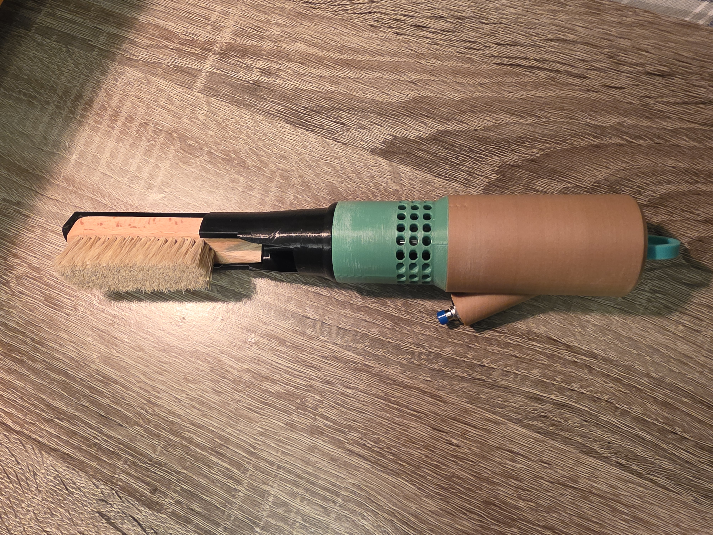
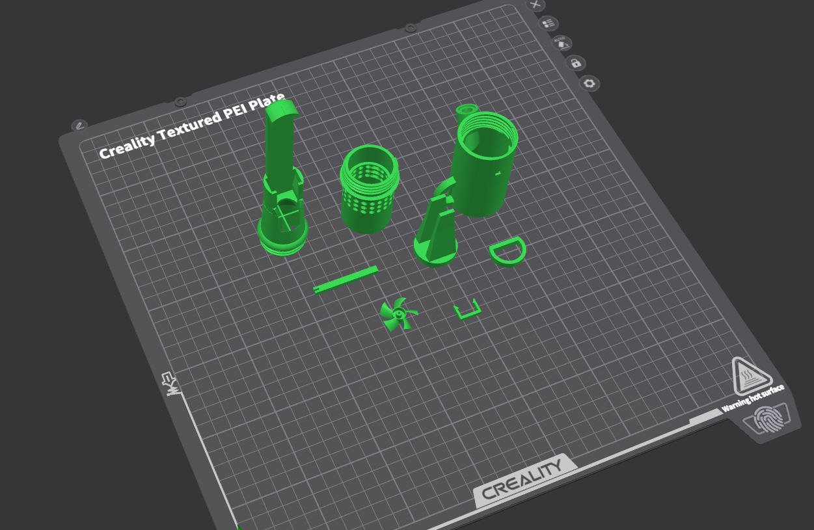
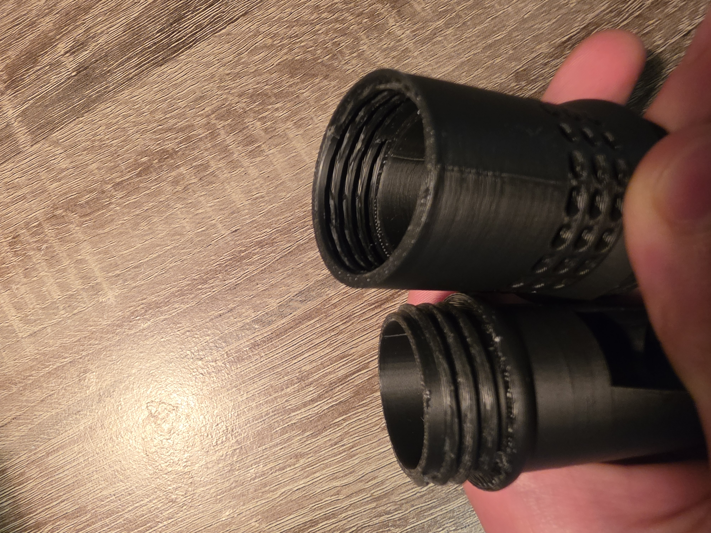
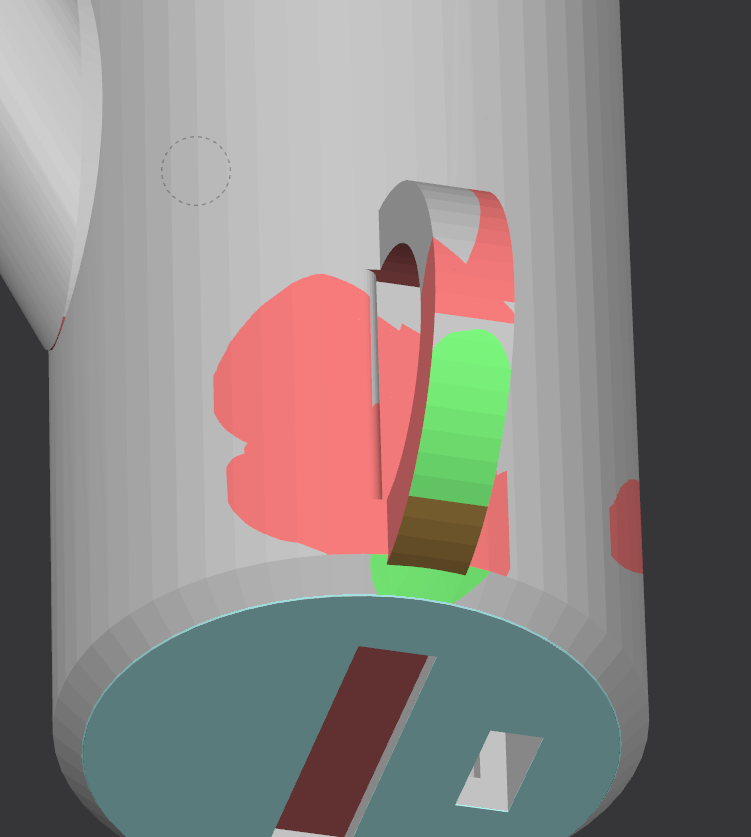
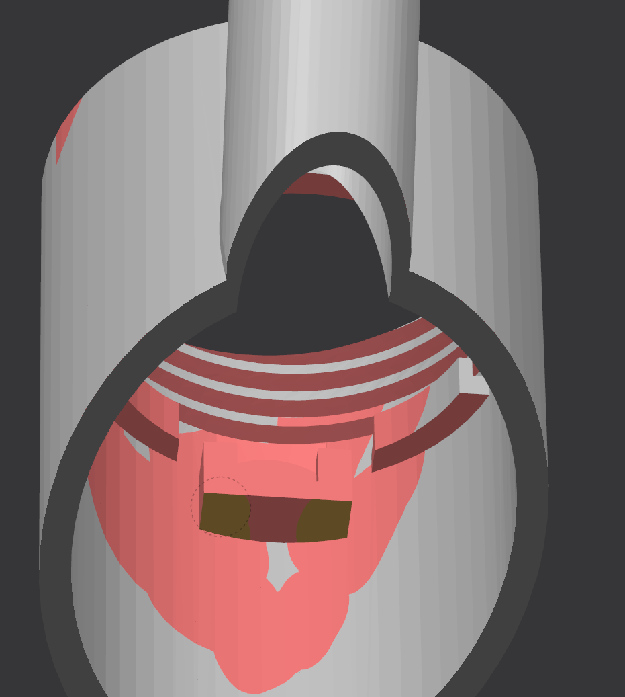
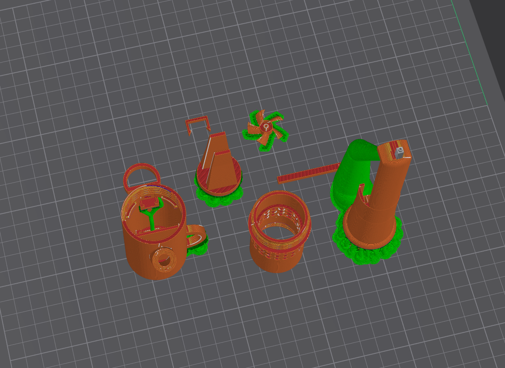
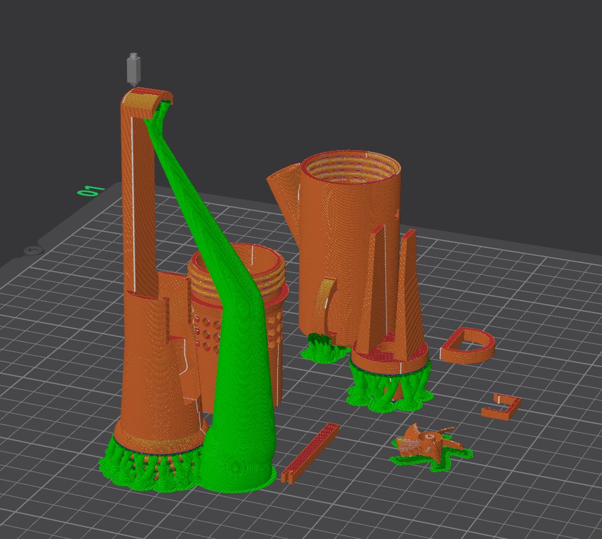
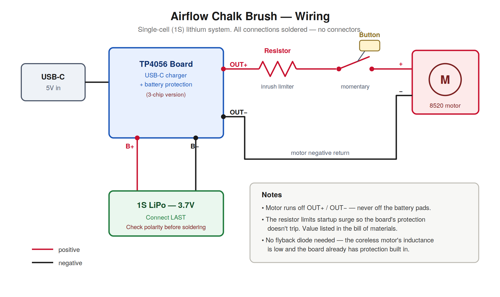
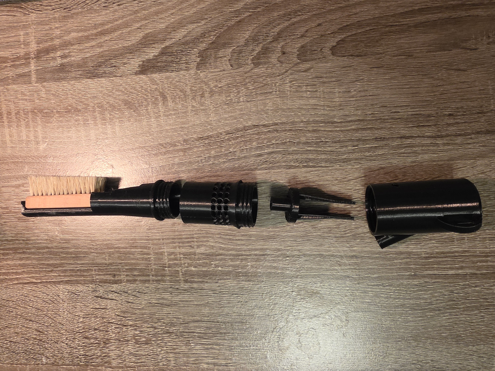
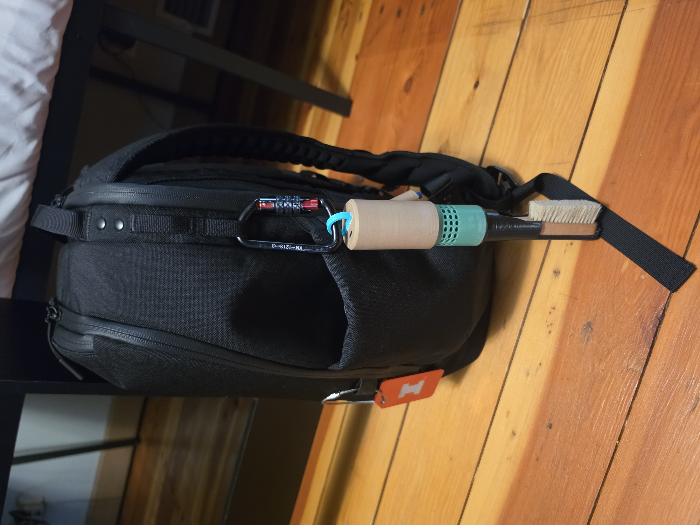

# Airflow Chalk Brush

A handheld, rechargeable brush for cleaning chalk off climbing holds. A small motor and impeller blow air out a nozzle right at the bristles, so loosened chalk gets carried away instead of resettling into the texture of the hold.

Designed to be cheap, easy to assemble, and fully 3D printable apart from a short list of off-the-shelf parts. Everything here is free to use, modify, and remix.

---

## Contents

- [What it does](#what-it-does)
- [How it works](#how-it-works)
- [Bill of materials](#bill-of-materials)
- [Printed parts](#printed-parts)
- [Print settings](#print-settings)
- [Support placement](#support-placement)
- [Assembly](#assembly)
- [Using it](#using-it)
- [Design notes](#design-notes)
- [Troubleshooting](#troubleshooting)
- [Remixing this design](#remixing-this-design)
- [Safety](#safety)
- [License](#license)

---

## What it does

Brushing a climbing hold knocks chalk loose, but a lot of it just settles back into the surface. This brush adds a burst of air at the bristle line so the chalk you loosen actually leaves the hold.

The body is a threaded tube that stacks from the bottom up:

| Section | Contains |
|---|---|
| **Bottom** | LiPo battery, USB-C charging board, button, integrated carabiner clip |
| **USB board spacer** | Braces the charging board so plugging in a cable can't push it inward |
| **Motor mount** | Holds the motor; routes the motor wires *downward* into the bottom section |
| **Middle (hilt)** | Impeller chamber and air intakes |
| **Head** | Air channel, exit nozzle, and brush mount |

The main sections screw together with printed threads, so the brush fully disassembles for battery access or repair — no glue holding the body together.

One design decision worth explaining: the motor mount sits *between* the bottom and middle sections specifically so the motor's wires exit downward rather than upward. That puts every electrical component — battery, charging board, button, and both motor leads — inside the bottom section, which means **the entire circuit is soldered as one piece with no connectors anywhere.** Fewer parts, nothing to work loose, and nothing to accidentally unplug when you unscrew the brush.

Press and hold the button to run the motor. Release to stop. Charge over USB-C.

---

## How it works

Air is drawn in through intake holes in the middle section, pushed up past the impeller, and forced through a narrowing channel to a nozzle that exits at the base of the bristles.

The interesting engineering problem here is that a small axial fan is a **high-flow, low-pressure** device. It moves a lot of air when the path is open, but it stalls badly against a restriction. Early versions of this design had a nozzle that was too small, and instead of blowing air out the front, the fan simply recirculated it back out the intake holes — a lot of noise and no useful airflow.

The final design solves this by keeping total flow restriction low: a generously sized exit, a smooth gradual taper rather than an abrupt contraction, rounded rather than sharp-edged openings, and a tight impeller tip clearance so air doesn't leak backwards around the blades.

More detail in [Design notes](#design-notes).

---

## Bill of materials

> **Affiliate disclosure: I do not profit from any of these links.** They aren't affiliate links and I receive nothing if you buy through them. They're simply the exact parts I bought, linked so you can match what the model was designed around. Buy them anywhere you like.

| Part | Qty | Notes | Link |
|---|---|---|---|
| Coreless motor, 8520 (8.5 × 20 mm), 3.7 V | 1 | 1 mm shaft. Sold as micro-drone spares, usually in pairs. | https://www.amazon.com/dp/B07CPT5TSL?ref_=ppx_hzsearch_conn_dt_b_fed_asin_title_1 |
| 1S LiPo battery, 3.7 V | 1 | 2100mAh. Must physically fit the bottom section. | https://www.amazon.com/dp/B091YKTT9S?ref=ppx_yo2ov_dt_b_fed_asin_title |
| TP4056 USB-C charging module **with protection** | 1 | Get the 3-chip version (TP4056 + DW01A + FS8205). The 2-chip version has no battery protection. | https://www.amazon.com/dp/B07PKND8KG?ref_=ppx_hzsearch_conn_dt_b_fed_asin_title_3 |
| Momentary pushbutton, 12 mm | 1 | Rated 3 A or better. Panel-mounts through the printed hole. | amazon.com/dp/B07RTZVZ6L?ref_=ppx_hzsearch_conn_dt_b_fed_asin_title_4 |
| Series resistor | 1 | ~1 ohm. See [Troubleshooting](#troubleshooting) for why this is here. | any |
| Wooden brush head | 1 | Cut flat 20mm below the bottom bristles and make an indent (see photos) | https://www.amazon.com/dp/B08XKM8LL2?ref_=ppx_hzsearch_conn_dt_b_fed_asin_title_2 |
| Silicone wire, 22–24 AWG | — | Short lengths, red and black. | https://www.amazon.com/dp/B07TX6BX47?ref=ppx_yo2ov_dt_b_fed_asin_title&th=1 |
| Heat shrink tubing | — | Assorted small sizes. | — |

**Approximate total cost: cheaper than buying the stupid overpriced one I saw on Instagram**

Most items come in multi-packs, so the per-unit cost is lower if you build more than one.

### Substitutions

The design is not fussy about brands, but a few things do matter:

- **The charging board must have battery protection.** Boards without it will let a LiPo over-discharge, which ruins the cell and is a genuine fire risk.
- **The battery must be a single cell (1S / 3.7 V).** A 2S pack will destroy the motor and is not compatible with this charging board.
- **The motor must be rated for 3.7 V.** Many similar-looking motors are 6 V or 12 V and will barely turn on a 1S cell.

---

## Printed parts

Seven files, six required and one optional. Numbered in assembly order.

| # | File | Qty | Description |
|---|---|---|---|
| 1 | `bottom.stl` | 1 | Battery compartment, USB-C port opening, button hole, integrated carabiner clip |
| 2 | `usb-board-spacer.stl` | 1 | Sits between the bottom and the motor mount. Braces the charging board from behind so plugging in a USB cable can't push it out of position — this removes the need to glue the board in. |
| 3 | `motor-mount.stl` | 1 | Holds the motor. Sits between the bottom and middle sections, with a pass-through for the motor wires to route down into the bottom. |
| 4 | `middle-hilt.stl` | 1 | Impeller chamber and air intakes |
| 5 | `head.stl` | 1 | Air channel, exit nozzle, and brush mount |
| 6 | `switch-clip.stl` | 1 | Retains the button and prevents accidental activation in a bag or on a harness. hold in the switch so it does not fall out of its housing |
| 7 | `carabiner-clip.stl` | 0–1 | **Optional.** Standalone replacement for the carabiner clip already built into the bottom section. If that clip snaps off, glue this one on instead of reprinting the whole bottom. |

---

## Print settings

These are what I used. A starting point, not gospel — your printer may want different numbers.

| Setting | Value |
|---|---|
| Material | PLA or Nylon (recommended, but PLA is plenty strong) |
| Layer height | 0.2mm |
| Walls / perimeters | 3 |
| Infill | any |
| Supports | Yes — see below |
| Print orientation | see images |

### Notes on printing threads

The threads are modeled as real geometry (trapezoidal profile, 3 mm pitch, 1.5 mm depth) rather than cosmetic thread features, so they print and function as actual threads.

They're designed with **0.4 mm radial clearance** between the male and female parts. If your printer runs tight and the sections won't thread together, that clearance is the thing to adjust — either scale slightly or reprint from the source CAD with a larger gap. If they thread together loosely and wobble, reduce it.

Trapezoidal threads were chosen over sharp V-threads specifically because they print reliably on FDM: the flat crests and roots don't need fine resolution to come out clean, and they self-align when screwing together.

---

## Support placement

Where I placed supports:

**Bottom**

**Motor mount**

**Remaining parts**

ALL supports work best as tree/organic supports
Avoid putting supports on: middle, switch clip, usb board spacer, clip.
Auto supports: head, fan
Custom Supports: bottom, motor mount

---

## Assembly

### 1. Test fit the printed parts

Before adding electronics, screw the bottom, middle, and head sections together and confirm the threads engage smoothly. Clean up any stringing or elephant's foot on the thread starts. If sections bind, chase the threads by screwing them together and apart a few times — printed threads usually loosen up after a few cycles.

Also dry-fit the spacer and motor mount to confirm they seat flat and the wire pass-through lines up.

### 2. Mount the motor

Press the motor into its pocket in `03-motor-mount.stl`. It should be a snug fit; a dab of CA glue will hold it if your print runs loose.

Feed the motor leads **down** through the wire pass-through so they come out on the bottom side of the mount. This is the whole point of this part — every electrical connection ends up in the bottom section, so nothing needs connectors.

**[FILL IN: wire length that works well]**

### 3. Wire the electronics

1. Solder the **series resistor** inline on the motor's positive lead. Insulate it with heat shrink.
2. Solder the **button** inline on that same positive lead, between the board's `OUT+` and the resistor.
3. Solder the **motor negative** lead to the board's `OUT−`.
4. **Last**, connect the battery to the board's `B+` and `B−` pads.

> **Wire the battery last, and tape the battery leads while you work.** A 1S LiPo can deliver a very high short-circuit current. Double-check polarity against the board silkscreen before connecting — some cheap batteries ship with reversed connector pinouts.

Test the circuit before anything goes into the housing. It is much easier to fix a bad joint on the bench than inside a tube.

### 4. Install the button and switch clip

Push the button through the hole in the bottom section and secure it with its included nut.

Fit `06-switch-clip.stl` to retain it. The switch clip just fits over the switch in the bottom once the switch is installed to prevent it from slipping out of its housing. The switch keeps the device from activating in your gym bag on accident. 

### 5. Fit the charging board, spacer, and battery

Seat the TP4056 board so the USB-C port lines up with the opening in the bottom section.

Fit `02-usb-board-spacer.stl` behind the board. The spacer takes the insertion force from the USB cable, so the board stays put without glue. Check by plugging a cable in and confirming the board doesn't shift.

Tuck the battery into the bottom compartment. 

### 6. Stack the assembly

BE CAREFUL NOT TO SQUISH THE WIRES WHEN SCREWING THE BOTTOM INTO THE MIDDLE!!!!!!

Working from the bottom up:

1. **Bottom** — battery, board, spacer, button, switch clip, and all soldered connections
2. **Motor mount** — motor installed, wires routed down into the bottom
3. **Middle (hilt)** — screws onto the bottom, capturing the motor mount in the stack
4. **Head** — screws onto the middle

### 7. Fit the impeller

Press the propeller onto the motor shaft. The more open side of the propeller (fan) should be facing upward, see the images, but its the same orientation as on the build plate)

Spin it by hand and confirm it turns freely without touching the chamber walls.

### 8. Attach the brush head

Once the brush head is cut and will fit, just bend the top of the head slightly (careful not to break it off) and slide the brush into the head.

### 9. Final test

Assemble fully, press the button, and confirm the motor spins up and air comes out the nozzle.

### Optional: spare carabiner clip

`07-carabiner-clip.stl` is only needed if the clip built into the bottom section breaks. If that happens, remove what's left of the original and glue this one on — no need to reprint the entire bottom section.

Use any CA glue (and activator for best application) to glue in the carabiner clip to the bottom of the assembly.
---

## Using it

- Hold the button to run the motor. Use short bursts or an extended press while brushing the hold or after brushing to loosen the chalk — a few seconds is plenty for a hold.
- Brush the hold as normal; the airflow clears the chalk you loosen.
- Charge over USB-C. The charging board's LED indicates charge state (typically red charging, blue/green full).
- **Don't run the motor while charging.** The board detects a full charge by sensing current draw, and a load on the output confuses that detection, so it may never terminate the charge properly.

Runtime is effectively unlimited for normal use — at burst usage you'll go weeks between charges.

---

## Design notes

For anyone wanting to understand *why* it's built this way, or planning to modify it. Also an honest record of what didn't work.

### The airflow problem

The core difficulty is that **an axial fan (a propeller) produces high flow but very little pressure.** A small coreless motor spinning a propeller might produce on the order of 50–150 Pa. Forcing air through a narrow nozzle at high velocity needs several hundred Pa or more.

When you connect a low-pressure fan to a high-resistance nozzle, the fan stalls: it can't push air forward, so air recirculates around the blade tips and escapes back out the intake. The device gets loud and does nothing. This is exactly what the first several revisions did.

What helped, roughly in order of impact:

1. **A larger exit opening.** By far the biggest factor. Small nozzles feel intuitively right (fast jet!) but are the direct cause of stall with this class of fan.
2. **A smooth, gradual taper into the exit.** An abrupt contraction causes large pressure losses; a gentle cone recovers a lot of that.
3. **Rounded rather than sharp-edged openings.** A sharp edge makes the flow separate, which shrinks the working area below the hole's physical area.
4. **Tight impeller tip clearance.** Air leaking over the blade tips from the high-pressure side back to the low-pressure side directly reduces achievable pressure. Aim for roughly 0.3–0.5 mm total.
5. **Keeping the intake generous.** Restricting the intake to "balance" it against the exit is counterproductive — it adds restriction to the side that wasn't the problem.

### What I tried that didn't work

- **A 5015 centrifugal blower.** Centrifugal blowers make far more static pressure than axial fans and would be the technically correct choice for a narrow, high-velocity nozzle. But most 5015 units sold are 12 V or 24 V, and a 12 V blower on a 3.7 V cell barely turns. Running one properly would need a boost converter, which adds complexity this design was trying to avoid. **If you want to remix toward a centrifugal design, get a genuinely 5 V-rated blower and verify the rating before modeling a housing around it.**
- **Stator vanes.** Straightening vanes downstream of the propeller should recover swirl energy as pressure, and they work in principle — but they're sensitive to angle and spacing, and my attempts didn't produce a measurable improvement. Opening up the flow path was far more effective for far less effort.
- **A capacitor for inrush suppression.** See [Troubleshooting](#troubleshooting).

The jet deflection issue was essentially that the air was swirling inside the head before exiting, causing it to exit at a non-optimal angle. The fins inside force the air to come out straight.

### Thread design

Threads are trapezoidal, swept along a helix as real geometry:

| Joint | Major diameter | Pitch | Depth | Clearance |
|---|---|---|---|---|
| Bottom ↔ Middle | 35 mm | 3 mm | 1.5 mm | 0.4 mm radial |
| Middle ↔ Head | 30 mm | 3 mm | 1.5 mm | 0.4 mm radial |

Both use right-handed threads with about 3 turns of engagement, plus a 1 mm chamfer at each thread start so the sections are easy to begin threading.

Threads deliberately stop short of the end of each section rather than running all the way out. That runout zone prevents the fragile overhanging partial thread you get otherwise, and it's how real fasteners are made.

---

## Troubleshooting

### The motor blips on for an instant and stops

The protection circuit is tripping on inrush current. A motor starting from a standstill briefly draws far more current than it does while running, and the protection chip reads that surge as a short circuit and latches the output off.

The fix here is a **small series resistor** on the motor's positive lead, limiting the startup surge enough to stay under the protection threshold. It costs a little motor speed (roughly 10–20%) — not enough to matter for blowing chalk.

A large capacitor across the motor is the more elegant fix in theory, but it only works if the capacitor sits *directly* at the motor terminals. With any meaningful wire length in between, the wiring's inductance lets the fast edge of the surge through before the capacitor can respond. In this build that location wasn't practical, so the resistor is the better real-world answer.

### Air comes out of the intake holes instead of the nozzle

The fan is stalling against too much restriction. See [Design notes](#design-notes). Enlarge and smooth the exit — don't shrink the intake.

### The sections won't thread together

Printed thread clearance is too tight for your printer. Run the threads together a few times to wear them in, clean up stringing on the thread starts, or reprint from the source CAD with more clearance.

### The motor doesn't spin at all

Check battery polarity at the board, confirm the battery has charge, and confirm you have the protected (3-chip) board with the motor wired to `OUT+`/`OUT−` rather than directly to the battery pads.

---

## Remixing this design

**[FILL IN: public Onshape document link]**

The full parametric CAD is shared publicly, not just the STLs. If you want to change a dimension — battery size, brush mount, nozzle diameter, thread clearance — editing the source model is far easier than modifying a mesh.

To use it: open the link, then **Make a copy** into your own Onshape account (a free hobbyist account works). From there everything is editable.

Modifications that would be genuinely useful:

- A version sized around a different battery or brush head
- A centrifugal version using a verified 5 V blower
- A version with heat-set inserts instead of printed threads
- A nozzle variant tuned for a different balance of flow versus velocity

If you build one or improve it, I'd love to see it.

---

## Safety

**Lithium batteries deserve respect.** This project uses a bare LiPo cell inside an enclosed printed housing.

- Use a charging board **with built-in protection**. Over-discharging a LiPo can ruin the cell or start a fire.
- Never puncture, crush, or sharply bend the cell. Take care when closing the housing that no wire or printed edge presses into it.
- Don't charge unattended, and don't charge a cell that's swollen, hot, or physically damaged.
- Check polarity before connecting the battery. Reverse polarity can destroy the board and damage the cell.
- Don't run the motor while charging.
- Keep fingers away from the impeller while it's spinning, and don't run it with the head removed.

This design is shared as-is with no warranty. You're responsible for building and using it safely.

---

## License

This work is licensed under [CC BY-SA 4.0](https://creativecommons.org/licenses/by-sa/4.0/). You may share and adapt it, including commercially, provided you give credit and license derivatives under the same terms.

---

## Acknowledgements

**[FILL IN: brush manufacturer, any prop/impeller design you used or adapted, and anyone who helped or tested it. If you used someone else's model, credit them here and confirm their license permits it.]**
